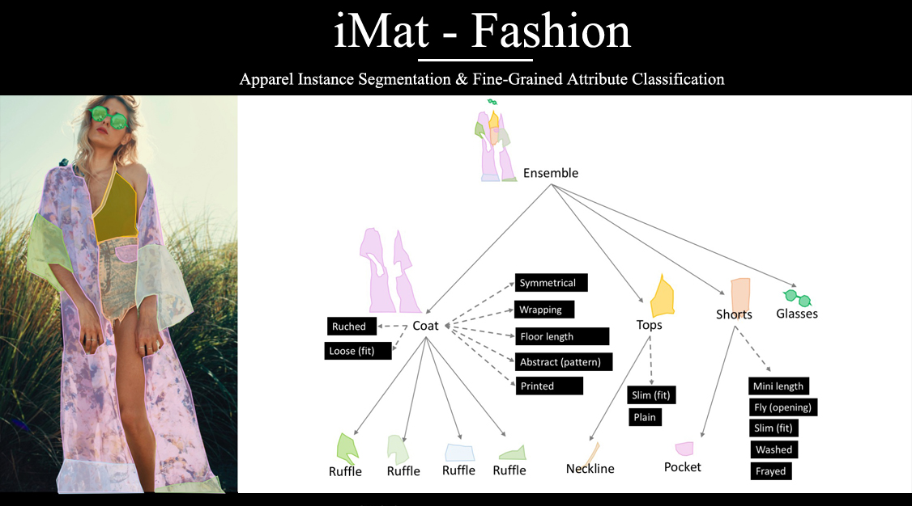
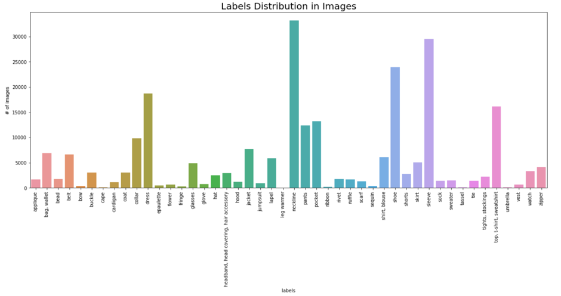
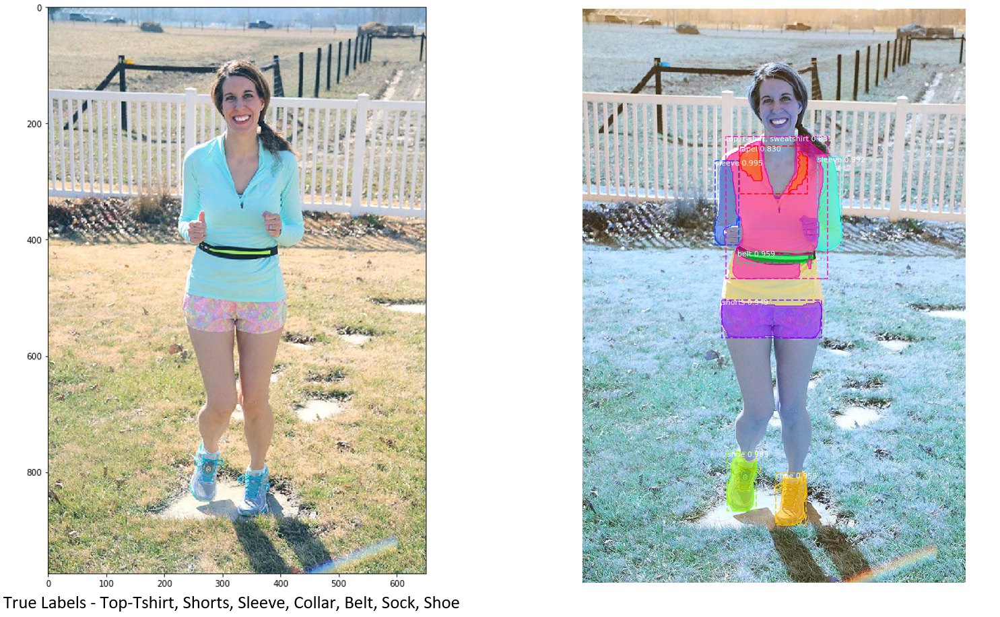

# Instance Segmentation on fashion images

# Introduction
This project was done for the Advanced Predictive Modeling course at The University of Texas at Austin and this repository contains all the codes and files pertaining to this project. This Project utilizes the Instance segmentation capabilities of Mask RCNN to identify and localize the clothing attributes in a given fashion image/video. Please refer to our medium article to get a comprehensive outlook of our project - https://medium.com/@manasrai/a-model-with-an-eye-for-fashion-d1aedbadee8c

# Data Overview
This dataset taken from the Kaggle competition iMaterialist 2019 has a blend of snaps from daily life to celebrity events, and online shopping. It had 46 apparel objects, 92 fine-grained attributes spread over 45,625 training and 3,200 test images. Link to the Kaggle competition: https://www.kaggle.com/c/imaterialist-fashion-2019-FGVC6

# Approach
•	Used Matterport’s implementation of Mask R-CNN which is based on ResNet backbone 
•	Took a small sample of training set (~5000 images) to train the model using Google Colab 
•	Leveraged weights trained on COCO dataset and trained all the layers to customize it for our problem 
•	Tuned the model using different combinations of hyperparameters (learning rate, epochs, number of dense layers and nodes)

# Sample output

